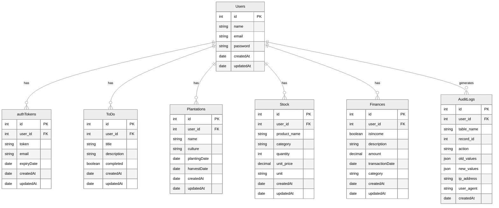

```mermaid
%%{init: {'theme': 'neutral'}}%%
erDiagram
    Users ||--o{ authTokens : has
    Users ||--o{ ToDo : has
    Users ||--o{ Plantations : has
    Users ||--o{ Stock : has
    Users ||--o{ Finances : has
    Users ||--o{ AuditLogs : generates

    Users {
        int id PK
        string name
        string email
        string password
        date createdAt
        date updatedAt
    }

    authTokens {
        int id PK
        int user_id FK
        string token
        string email
        date expiryDate
        date createdAt
        date updatedAt
    }

    ToDo {
        int id PK
        int user_id FK
        string title
        string description
        boolean completed
        date createdAt
        date updatedAt
    }

    Plantations {
        int id PK
        int user_id FK
        string name
        string culture
        date plantingDate
        date harvestDate
        date createdAt
        date updatedAt
    }

    Stock {
        int id PK
        int user_id FK
        string product_name
        string category
        int quantity
        decimal unit_price
        string unit
        date createdAt
        date updatedAt
    }

    Finances {
        int id PK
        int user_id FK
        boolean isIncome
        string description
        decimal amount
        date transactionDate
        string category
        date createdAt
        date updatedAt
    }

    AuditLogs {
        int id PK
        int user_id FK
        string table_name
        int record_id
        string action
        json old_values
        json new_values
        string ip_address
        string user_agent
        date createdAt
    }

```